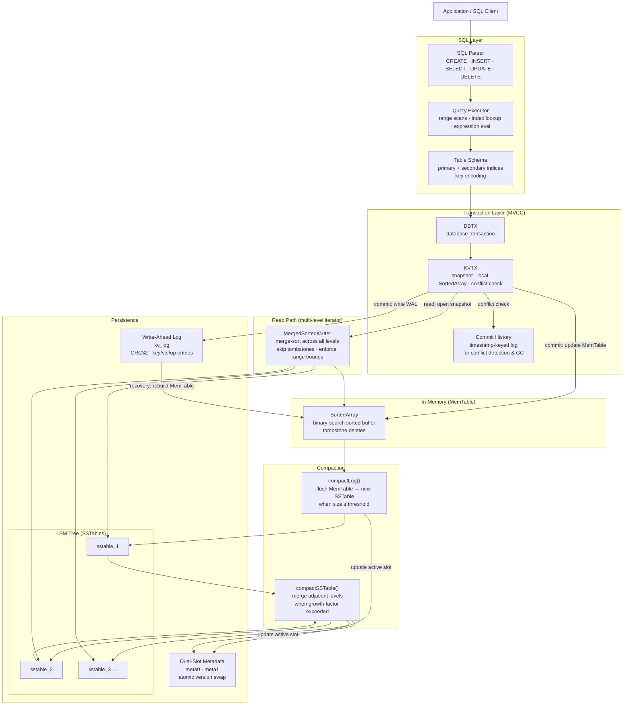

implementing a KV store in golang with lsm trees, sstables and concurrent access.

## System Design

### Component Summary

| Component | Role |
|---|---|
| **SQL Parser** | Tokenises and parses SQL into an AST; supports `CREATE TABLE`, `INSERT`, `SELECT`, `UPDATE`, `DELETE` with full expression grammar |
| **Query Executor** | Translates AST into ranged KV scans using schema-aware key encoding; evaluates WHERE expressions |
| **KVTX / DBTX** | Snapshot-isolated transactions; each TX writes to a local `SortedArray` and merges on commit |
| **Conflict Detection** | Timestamp-keyed history log detects write-write conflicts; returns `ErrTXConflict` on clash |
| **MemTable** | In-memory `SortedArray` (binary search, tombstone deletes); absorbed on every commit |
| **Write-Ahead Log** | Append-only log with CRC32 checksums; replayed on startup to recover the MemTable |
| **SSTables** | Immutable on-disk sorted files; index block + data block; binary search via `Seek()` |
| **LSM Compaction** | Background goroutine flushes MemTable and merges SSTable levels using a growth-factor heuristic |
| **Dual-Slot Metadata** | Two metadata files (`meta0`/`meta1`) swapped atomically by version number; no fsync needed |
| **MergedSortedKVIter** | Merge-sort iterator across all levels; lowest key wins; tombstones suppress older entries |
