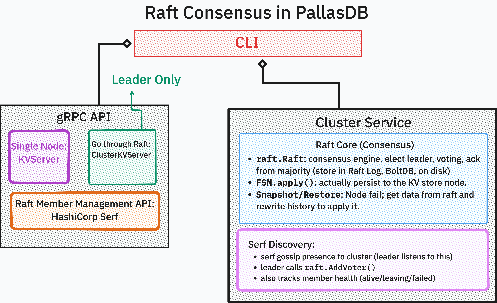

# Architecture

PallasDB is four layers. Each one is a package you can use on its own, and each
one is a strictly smaller contract than the one above it.

```
cmd/pallasdb        CLI: flags, config, process lifecycle
      |
grpc                KVService, SQLService, ClusterService over Protocol Buffers
      |
cluster             Raft replication; FSM applying committed commands
      |
db                  LSM storage engine, transactions, table/SQL layer
```


## Storage engine (`db`)

An LSM tree. Writes append to a write-ahead log and land in an in-memory sorted
memtable; when the memtable fills, it is flushed to an immutable sorted string
table (SSTable) on disk. Reads consult the memtable and then each SSTable level
in order, merging sorted streams. Compaction merges levels in the background and
retires superseded tables.

The version of the on-disk table set is tracked in a double-buffered metadata
file, so a crash mid-update leaves one intact copy to recover from. See
[Durability model](durability.md).

`db.KV` is the key-value contract: `Get`, `Set`, `SetEx`, `Del`, `NewTX`,
`Compact`. `db.KVTX` is a transaction: a snapshot plus staged writes, with
conflict detection at commit and range scans over the snapshot.

## Table and SQL layer (`db.DB`)

`db.DB` sits on the same engine and adds typed rows. A table has a schema
(named columns of `int64` or `string`), a primary key, and optional secondary
indexes; rows are encoded into the key-value space with the index prefix in the
key. `db.ExecStmt` parses and runs a SQL statement against that layer. See
[SQL surface](sql.md) for what the parser accepts.

## Replication (`cluster`)



Mutating operations are encoded as commands and go through Raft. The leader
replicates the command; once committed, every node applies it to its own FSM,
which wraps a local `*db.KV`. Reads can be served from local FSM state or
verified against the leader, depending on the consistency level in the request.

Snapshots stream the key-value pairs of the whole store; restore stages the
replacement directory and swaps atomically, so a failed restore leaves the node
serving its original data.

Membership uses Serf gossip for discovery and Raft configuration changes for
voting rights: a joining node starts as a non-voter and is promoted once it has
caught up.

## Transport (`grpc`)

`grpc.NewGRPCServer` builds the single-node server; `grpc.NewClusterGRPCServer`
builds the replicated one. `KVService` exposes point operations and a
server-streaming `Range`; `SQLService.Query` streams a header message with the
column list, then one message per row, then a `rows_affected` message for
non-`SELECT` statements. `ClusterService` covers join, leave, membership, and
leader lookup.

The `db` package never imports gRPC or protobuf. Conversion between `db.Cell`
and the wire `Value` type lives in `grpc`, which keeps the engine usable as a
plain Go library.

## Where a write goes

Single node:

```
client -> grpc.KVServer.Put -> db.KV.SetEx -> WAL append + fsync -> memtable
```

Cluster:

```
client -> grpc.ClusterServer.Put -> raft.Apply(command)
       -> quorum commit -> FSM.Apply on every node -> db.KV.SetEx
```

A follower that receives a write forwards it to the leader, or returns the
leader's address so the client can retry there; the Go client in `client/` does
that retry automatically.
